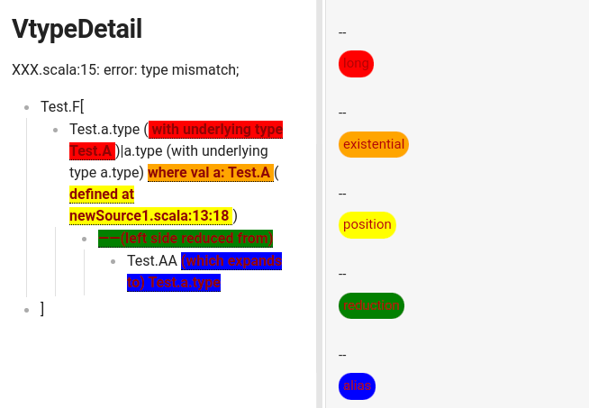
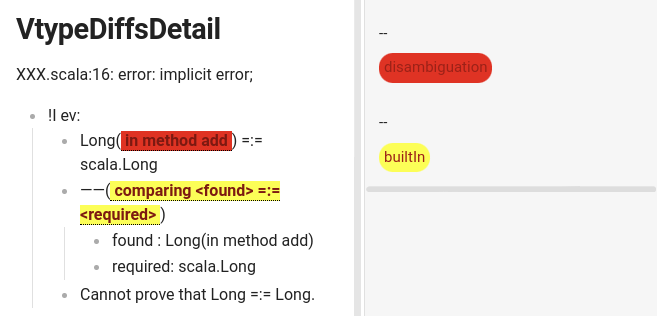

# A scala compiler plugin for more concise errors

This plugin removes some of the redundancy of the compiler output and prints
additional info for implicit resolution errors.

# Versions

TL;DR

```
                 ┌──────────────────────────┐                  
                 │What's your Scala version?│                  
                 └─────────┬───────┬────────┘                  
                           │       │                           
                           │       └───────────────────┐       
                           v                           │       
    ┌─────────────────────────────────────────────┐    │       
    │                ( >= 2.13.6 )                │    │       
    │                ─────────────                │    │       
    │Do you want experimental features & bugfixes?│    │       
    └──┬───────────────┬──────────────────────────┘    │       
       │               │                               │       
       v               v                               v       
 ┌──────────┐ ┌─────────────────┐ ┌───────────────────────────┐
 │ ( yes )  │ │     ( no )      │ │( 2.12 / 2.13.0 .. 2.13.5 )│
 │ ───────  │ │     ──────      │ ├───────────────────────────┤
 │Splain 1.x│ │Compiler built-in│ │       Splain 0.5.x        │
 └──────────┘ └─────────────────┘ └───────────────────────────┘
```

### Compiler built-in

(main article: https://docs.scala-lang.org/overviews/compiler-options/index.html#Verbose_Settings)

The basic Splain features has been integrated into Scala compiler (since 2.13.6, through contributions like [this](https://github.com/scala/scala/pull/7785) and [this](https://github.com/scala/scala/pull/10029)), they can be enabled immediately by using the right compiler options (see **Option** section for detail).

### v1.x (master branch)

(Only available for Scala 2.13.6+)

Splain 1.x is a simplified rewrite that aims to incrementally introduce enhancement to the already integrated Splain features. Additional features and bugfixes will first be released and refined here, then be periodically contributed back into Scala compiler.

Effectively, **Splain 1.x is now a feature preview patch of Scala compiler**, if a relevant compiler built-in option (see **Option** section for detail) malfunctions, it may work with Splain v1.x enabled.

It is also the only branch under active development.

### v0.5.x (maintenance branch)

(Only available for Scala 2.12 and Scala 2.13.0 .. 2.13.5)

The latest v0.x will continue to be maintained and published regularly to stay compatible with the latest Scala 2.12.x release (until it's end-of-life), but no newer version will be published for Scala 2.13, **splain 0.5.x will be the last release for Scala 2.13**.

We strongly recommend you to upgrade to Scala 2.13.6+ to benefit from active support and up-to-date features.

### Build Matrix

| Version                          | Status                                                                                                                                                            | Compatibility                                                                                 |
|----------------------------------|-------------------------------------------------------------------------------------------------------------------------------------------------------------------|-----------------------------------------------------------------------------------------------|
| v1.x <br> (current) - latest     | [](https://github.com/tek/splain/actions/workflows/main.yml)               |                |
| v1.0.3 <br> (current)            | [](https://github.com/tek/splain/actions/workflows/main.yml)        |         |
| v1.0.2 <br> (current)            | [](https://github.com/tek/splain/actions/workflows/main.yml)        |         |
| v1.0.1 <br> (current)            | [](https://github.com/tek/splain/actions/workflows/main.yml)        |         |
| v1.0.0 <br> (current)            | [](https://github.com/tek/splain/actions/workflows/main.yml)        |         |
| v1.0.0-RC2 <br> (current)        | [](https://github.com/tek/splain/actions/workflows/main.yml)    |     |
| v1.0.0-RC1 <br> (current)        | [](https://github.com/tek/splain/actions/workflows/main.yml)    |     |
| v0.x <br> (maintenance) - latest | [](https://github.com/tek/splain/actions/workflows/main.yml) |  |

# Usage

### v1.x, v0.x

Include this line in your `build.sbt` (_not_ `project/plugins.sbt`!!):

```sbt
addCompilerPlugin("io.tryp" % "splain" % "0.5.8" cross CrossVersion.patch)
```

If you want to support scala versions both newer and older than `2.12.5`, use:

```sbt
libraryDependencies += {
  val v =
    if (scalaVersion.value.replaceFirst(raw"\.(\d)$$",".0$1") <= "2.12.04") "0.4.1"
    else "0.5.8"
  ("io.tryp" %% "splain" % v cross CrossVersion.patch).withConfigurations(Some("plugin->default(compile)"))
}
```

If you are using gradle with scala plugin, include this line under the dependency section of your build.gradle:

```groovy
scalaCompilerPlugins group: 'io.tryp', name: 'splain_${scalaVersion}', version: '0.5.8'
```

or build.gradle.kts:

```kotlin
scalaCompilerPlugins("io.tryp:splain_${scalaVersion}:0.5.8")
```

### compiler built-in, no plugin declaration required

Its effects however still have to be enabled in your compiler options, in minimal case, by the following 2 options (see Options for details):

```
-Vimplicits -Vtype-diffs
```

# Options

The plugin can be configured via compiler Options with the format:

| v0.x                          | built-in, v1.x       |
|:----------------------------- | -------------------- |
| `-P:splain:<param>[:<value>]` | `-<param>[:<value>]` |

`param` can be one of the following:

| v0.x              | built-in, v1.x                            | default value    |
| ----------------- |-------------------------------------------|------------------|
| `all`             | `enabled`                                 | true             |
| `infix`           | (dropped)                                 |                  |
| `foundreq`        | `Vtype-diffs`                             | false            |
| `implicits`       | `Vimplicits`                              | false            |
| `bounds`          | (dropped)                                 | false            |
| `color`           | (dropped)                                 |                  |
| `breakinfix`      | (dropped)                                 | 0                |
| `tree`            | `Vimplicits-verbose-tree`                 |                  |
| `compact`         | (dropped)                                 | false            |
| `boundsimplicits` | (dropped)                                 |                  |
| `truncrefined`    | `Vimplicits-max-refined`                  | 0                |
| `rewrite`         | (dropped)                                 | (do not rewrite) |
| `keepmodules`     | (dropped)                                 | 0                |
| (N/A)             | `P:splain:Vimplicits-diverging`           | false            |
| (N/A)             | `P:splain:Vimplicits-diverging-max-depth` | 100              |
| (N/A)             | `P:splain:Vtype-detail`                   | 1                |
| (N/A)             | `P:splain:Vtype-diffs-detail`             | 1                |


`value` can either be `true` or `false`. If omitted, the default is `true` for
both value and parameter.

The parameter `all` can be used to deactivate all features.

The parameters can be applied like this:

(in sbt)

```sbt
scalacOptions += "-P:splain:implicits:false"
```

(in gradle with scala plugin)

```kotlin
withType<ScalaCompile> {
    scalaCompileOptions.apply {
        additionalParameters = listOf("-P:splain:implicits:false")
    }
}
```

# infix types

Instead of `shapeless.::[A, HNil]`, prints `A :: HNil`.

# found/required types

Rather than printing up to four types, only the dealiased types are shown as a colored diff:


special consideration for `shapeless.Record`:


In the case of refined types in the form of `Client with Database with
Publisher`, the types will be matched with each other and a missing or surplus
type will be indicated by a `<none>` label.

# implicit resolution chains

When an implicit is not found, only the outermost error at the invocation point
is printed. This can be expanded with the compiler flag `-Xlog-implicits`, but
that also shows all invalid implicits for parameters that have been resolved
successfully.
This feature prints a compact list of all involved implicits:


Here, `!I` stands for *could not find implicit value*, the name of the implicit
parameter is in yellow, and its type in green.

If the parameter `tree` is set, the candidates will be indented according to their nesting level:


If the parameter `compact` is set, only the first and last implicit in a chain will be printed.

If the parameter `boundsimplicits` is set to false, any **nonconformant bounds** errors will be suppressed.

For comparison, this is the regular compiler output for this case (with
formatted types):

```
[info] unit/src/basic.scala:35: f is not a valid implicit value for
splain.ImplicitChain.T2 because:
[info] hasMatchingSymbol reported error: could not find implicit value for
parameter impPar2: (D *** (C *** String)) >:< ((C,D,C) *** D)
[info]   implicitly[T1]
[info]             ^
[info] unit/src/basic.scala:35: g is not a valid implicit value for
splain.ImplicitChain.T1 because:
[info] hasMatchingSymbol reported error: could not find implicit value for
parameter impPar1: D *** ((C >:< C) *** (D => Unit))
[info]   implicitly[T1]
[info]             ^
[error] unit/src/basic.scala:35: could not find implicit value for
parameter e: (C *** D) >:< C with D {type A = D; type B = C}
[error]   implicitly[T1]
```

# infix type and type argument line breaking

If the parameter `breakinfix` is given and greater than 0, types longer than
that number will be split into multiple lines:

```
implicit error;
!I e: String
f invalid because
!I impPar4: List[
  (
    VeryLongTypeName ::::
    VeryLongTypeName ::::
    VeryLongTypeName ::::
    VeryLongTypeName
  )
  ::::
  (Short :::: Short) ::::
  (
    VeryLongTypeName ::::
    VeryLongTypeName ::::
    VeryLongTypeName ::::
    VeryLongTypeName
  )
  ::::
  VeryLongTypeName ::::
  VeryLongTypeName ::::
  VeryLongTypeName ::::
  VeryLongTypeName
]
```

# truncating refined types

A type of the shape `T { type A = X; type B = Y }` will be displayed as `T {...}` if the parameter `truncrefined` is set
to a value `/= 0` and the refinement's length is greater than the value.

# truncating module paths

Default behaviour when printing type names is to omit the whole module path and only print the last segment.
Two options modify this behaviour:

## regex rewrite

The option `rewrite` takes a string that is parsed as a `;`-delimited list of regexes and optional replacements.

For example:

```
-P:splain:rewrite:cats\\.data/cd;.Type
```

This parses as two rewrite items:

* transform `cats.data` into `cd`
* delete all occurences of `.Type`

If a slash is present, the string following it will be used as a replacement for the matched text.
If it is absent, the empty string is substituted.

## dropping module segments by count

The option `keepmodules` determines how many segments of the module path before the type name will be displayed, but
only if the `rewrite` mechanism hasn't changed anything.

So with `-P:splain:keepmodules:2`, the qualified type `cats.free.FreeT.Suspend` will be displayed as
`free.FreeT.Suspend`, keeping the two segments `free.FreeT` before the type name.
The default is `0`, so only the type name itself will be displayed

# expanding diverging implicit errors (experimental)

A `diverging implicit error` is thrown by compiler if it cannot decide if an implicit search can terminate in polynomial time (e.g. if the search algorithm encounter a loop or infinite expansion). In most cases, such error will cause the entire search to fail immediately, but there are few exceptions to this rule, for which the search can backtrack and try an alternative path to fulfil the implicit argument. Either way, the Scala compiler error is only capable of showing the entry point of such loop or infinite expansion:

```
diverging implicit expansion for type splain.DivergingImplicits.C
starting with method f in object Circular
```

If the parameter `-P:splain:Vimplicits-diverging` is enabled, it will instruct the compiler to continue its implicit search process until an implicit resolution chain can be correlated with such error(s):

```
implicit error;
!I e: C
f invalid because
!I c: C
diverging implicit expansion for type C
starting with method f in object Endo
――f invalid because
  !I c: C
  diverging implicit expansion for type C
  starting with method f in object Endo
```

**EXPERIMENTAL!** sometimes this feature may cause failed implicit resolution to succeed, due to the delay in throwing the diverging implicit error. It may also increase compilation time slightly. If your build has been broken by this feature, please consider simplifying your code base to create a minimal reproducible test case, and submit it with a pull request.

# type detail (experimental)

The option `-P:splain:Vtype-detail:X` can take an integer from 1 to 6 to attach different kinds of details to type information in any error message.

- `1` (DEFAULT) : type info in short form, by using toString (same as pre-1.1.0)
- `2` = **long** : type info in long form, by using toLongString
- `3` = `2` + (**existential** : existential context)
- `4` = `3` + (**reduction** : explain type reduction process)
- `5` = `4` + (**position** : type definition position in code)
- `6` = `5` + (**alias** : explain type aliases, this generally contains duplicate information with `3`, it is only included for completeness)

For example:

(`-P:splain:Vtype-detail:1`)

```
XXX.scala:15: error: type mismatch;
  Test.F[Test.a.type|a.type]
```

(`-P:splain:Vtype-detail:6`)



In addition, multiple names of the detail kind (denoted by bold text in the above list) can be appended to the option value to enable it, e.g. `-P:splain:Vtype-detail:1,reduction,position` can attach type reduction process & type definition position while bypassing **long** and **existential**.

# type diffs detail (experimental)

The option `-P:splain:Vtype-diffs-detail:X` can take an integer from 1 to 4 to augment type diff errors with different kinds of details.

- `1` (DEFAULT) : no augmentation (same as pre-1.1.0)
- `2` = **disambiguation** : augment type info with disambiguation for both sides in `<found>|<required>` and infix types (e.g. `A =:= B`, `A <:< B`) in error message
- `3` = `2` + (**builtIn** : attach built-in found/required errors emitted by Scala compiler IF AND ONLY IF both sides of the error message are identical)
- `4` = `3` + (**builtInAlways** : ALWAYS attach original found/required error info, even if both sides of the error message are different)

In addition, multiple names of the detail kind (denoted by bold text in the above list) can be appended to the option value to enable it, e.g. `-P:splain:Vtype-diffs-detail:1,builtIn` can attach built-in errors while bypassing **disambiguation**.

For example:

(`-P:splain:Vtype-diffs-detail:1`)

```
XXX.scala:16: error: implicit error;
!I ev: Long =:= Long
  Cannot prove that Long =:= Long.
```

(`-P:splain:Vtype-diffs-detail:4`)



# Development

## Bugs

Due to the nature of the hack that allows _splain_ to hook into the implicit search algorithm, other plugins using the
same trick may not work or cause _splain_ to be inactive.

Another victim of _splain_ is scaladoc – doc comments might disappear when running the task with _splain_ active, so
make sure it is disabled before doing so.

Users are encouraged to submit issues and test cases directly through pull requests, by forking the project and adding new test cases under:

| v0.x                                   | v1.x                                               |
|:-------------------------------------- | -------------------------------------------------- |
| `<project root>/src/test/scala/splain` | `<project root>/core/src/test/scala/splain/plugin` |

The bug can thus be identified by the team quickly on our [continuous integration environment](https://github.com/tek/splain/actions). Submission on our GitHub issue tracker is also welcomed, but it generally takes much longer for the team to respond.

## How to compile

### v1.x (from git branch master)

Built with the latest [Gradle](https://gradle.org/), to compile and publish locally:

```
./gradlew clean testClasses publishToMavenLocal
```

to run all tests:

```
./gradlew test
```


### v0.x (from git branch Maintenance/master)

Built with the latest stable [SBT](https://www.scala-sbt.org/). to compile and publish locally:

```
sbt clean publishM2
```

to run all tests:

```
sbt test
```


## How to edit

Most project contributors uses neovim, IntelliJ IDEA or visual studio code.

The team strive for a strong discipline in software engineering. All commits (including SNAPSHOTs and PRs) will be compliant with [scalalfmt](https://scalameta.org/scalafmt/) standard.

## Communication

- @tek - reviewer for built-in/v0.x bugfix, new features
- @tribbloid - reviewer for v1.x bugfix
- @dwijnand - reviewer for scala compiler integration
