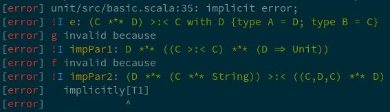

# A scala compiler plugin for more concise errors
This plugin removes some of the redundancy of the compiler output and prints
additional info for implicit resolution errors.

# Usage

```sbt
resolvers += Resolver.bintrayRepo("tek", "maven")
addCompilerPlugin("tryp" %% "splain" % "0.1.9")
```

# Configuration
The plugin can be configured via compiler plugin parameters with the format:
```
-P:splain:<param>[:<value>]
```
`param` can be one of the following:
* `all`
* `infix`
* `foundreq`
* `implicits`
* `bounds` (default off)
* `color`

`value` can either be `true` or `false`. If omitted, the default is `true` for
both value and parameter.

The parameter `all` can be used to deactivate all features.

The parameters can be applied like this:

```sbt
scalacOptions += "-P:splain:implicits:false"
```

# infix types
Instead of `shapeless.::[A, HNil]`, prints `A :: HNil`.

# found/required types
Rather than printing up to four types, only the dealiased types are shown as a
colored diff:


# implicit resolution chains
When an implicit is not found, only the outermost error at the invocation point
is printed. This can be expanded with the compiler flag `-Xlog-implicits`, but
that also shows all invalid implicits for parameters that have been resolved
successfully.
This feature prints a compact list of all involved implicits:


Here, `!I` stands for *could not find implicit value*, the name of the implicit
parameter is in yellow, and its type in green.

For comparison, this is the regular compiler output for this case (with
formatted types):
```
[info] unit/src/basic.scala:35: f is not a valid implicit value for
splain.ImplicitChain.T2 because:
[info] hasMatchingSymbol reported error: could not find implicit value for
parameter impPar2: (D *** (C *** String)) >:< ((C,D,C) *** D)
[info]   implicitly[T1]
[info]             ^
[info] unit/src/basic.scala:35: g is not a valid implicit value for
splain.ImplicitChain.T1 because:
[info] hasMatchingSymbol reported error: could not find implicit value for
parameter impPar1: D *** ((C >:< C) *** (D => Unit))
[info]   implicitly[T1]
[info]             ^
[error] unit/src/basic.scala:35: could not find implicit value for
parameter e: (C *** D) >:< C with D {type A = D; type B = C}
[error]   implicitly[T1]

```
